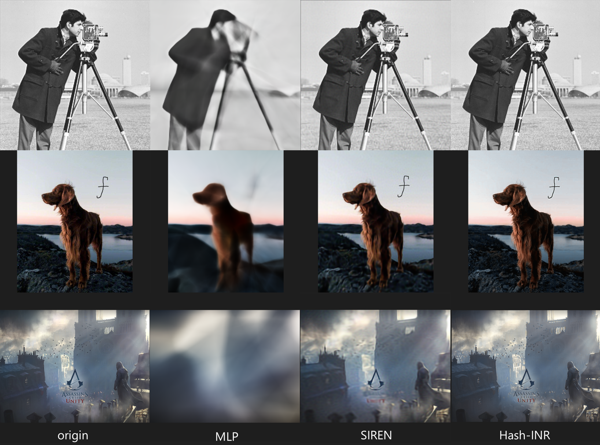

## HashINR
A PyTorch implementation of Hash-INR, an image hidden neural representation, using hash tables and neural networks to approximate the different frequency components of an image separately.



### Setup
This project is based on the `PyTorch` framework, so this project requires the `PyTorch` framework to run properly.
The easiest way to install it is to run the following command in the root directory of this project:
```
pip install -r requirements.txt
```
Other compatible `PyTorch` frameworks are also available.

For this project, the cuda framework is used for accelerating the model training process, so it is recommended to check `torch.cuda.is_available()` for your environment.


### Config
If custom training of another image is required, this can be done by modifying the `config.ini` file with the following important parameters:
- sidelength: the width and height of the image, recommended to be the same as the input image
- model_type: the model type, one of three options: "MLP", "Siren" or "HashINR"
- save_mod_path: the location where the weights are stored after the model has been trained
- img_path: path to the original image

Custom training and reconstruction can be done with the following commands:
```
python train.py --config ./config.ini 
python render.py --config ./config.ini 
```

The reconstructed images are defaultly saved in `output/recon.png` and the signal-to-noise ratio of the reconstructed image to the original image is calculated automatically.
